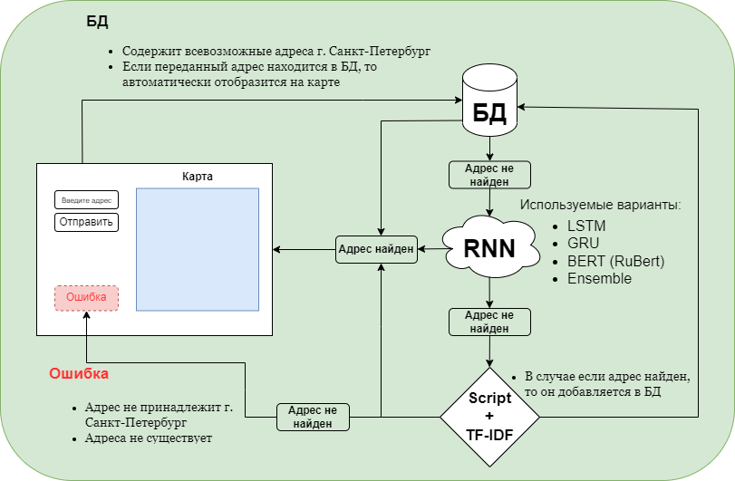

### Problem:
Hackathon participants, using artificial intelligence methods and data including full addresses of houses and buildings in St. Petersburg, will have to build a model that can adapt to the tasks of determining the correct address contained in the source database.

### Solution architecture:



### Starting the project (Linux):
1. Clone the project into the selected directory:
   ```bash
      git clone https://github.com/VeryLittleAnna/hacks_ai.git
   ```
2. In the ***hacks_ai*** folder you need to create an environment using the command:
   ```bash
      python3 -m venv myenv
   ```
3. Transition to the environment:
   ```bash
      source myenv/bin/activate
   ```
4. The entire web application is launched via Docker (must be installed) as follows:
   ```bash
      docker-compose build
      docker-compose up
   ```
