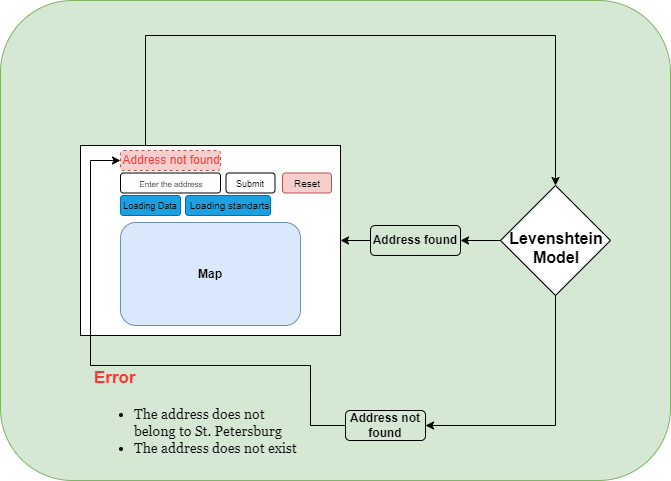

### Задача:
Участникам хакатона при помощи методов искусственного интеллекта и данных, включающих полные адреса домов и зданий г. Санкт-Петербурга, предстоит построить модель, которая сможет адаптироваться к задачам определения корректного адреса, содержащегося в исходной базе данных.

### Предлагаемое решение:

### Запуск проекта:
1. В папке ***hacks_ai*** необходимо создать среду через команду: ***python3 -m venv myenv***
2. Переход в окружение: ***source myenv/bin/activate***
3. Запуск всего веб приложения осуществляется через Docker (необходимо установить) следующим образом:
   - Сборка контейнера: ***docker-compose build***
   - Запуск контейнера: ***docker-compose up***
